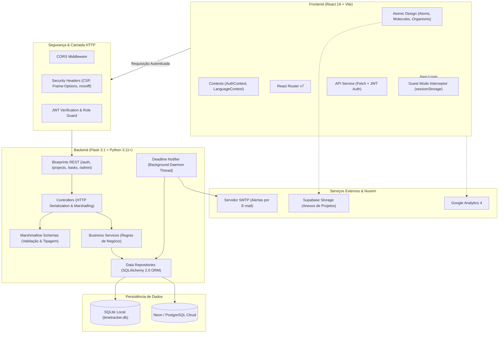

# Time Trackerígena

> Plataforma full stack para rastreamento de tempo, gestão de projetos, estimativa de custos multi-moeda e telemetria de produtividade, com arquitetura em camadas, modo visitante zero-friction e acessibilidade inclusiva.

[](https://react.dev)
[](https://flask.palletsprojects.com/)
[](https://www.sqlalchemy.org/)
[](https://www.postgresql.org/)
[](https://jwt.io/)
[](https://www.w3.org/WAI/standards-guidelines/wcag/)
[](LICENSE)

**Idioma / Language:** **Português (Atual)** | [English Version](README_EN.md)

---

## Sumário Executivo

1. [Visão Geral & Proposta de Valor](#visão-geral--proposta-de-valor)
2. [Por Que Este Projeto É Relevante?](#por-que-este-projeto-é-relevante)
3. [Decisões de Engenharia & Arquitetura](#decisões-de-engenharia--arquitetura)
4. [Diagrama de Arquitetura](#diagrama-de-arquitetura)
5. [Recursos & Usabilidade do Produto](#recursos--usabilidade-do-produto)
6. [Stack Tecnológica & Justificativas](#stack-tecnológica--justificativas)
7. [Como Executar o Projeto (Guia Rápido)](#como-executar-o-projeto-guia-rápido)
8. [Variáveis de Ambiente](#variáveis-de-ambiente)
9. [Especificação de Endpoints da API](#especificação-de-endpoints-da-api)
10. [Estrutura do Repositório](#estrutura-do-repositório)
11. [Acessibilidade (WCAG 2.1 AA) & Design System](#acessibilidade-wcag-21-aa--design-system)
12. [Segurança e Resiliência em Produção](#segurança-e-resiliência-em-produção)

---

## Visão Geral & Proposta de Valor

O **Time Trackerígena** é uma aplicação web full stack projetada para suprir as lacunas deixadas por ferramentas genéricas de controle de tempo. Desenvolvido para freelancers, desenvolvedores autônomos e equipes dinâmicas, o sistema une **controle de tempo em tempo real** com **gestão granular de projetos, faturamento multi-moeda e monitoramento de metas orçamentárias**.

A solução resolve os seguintes desafios do dia a dia:
- **Precificação e Faturamento Exatos**: Cada tarefa pode conter sua própria taxa horária em moeda customizada (BRL, USD, EUR, GBP), horas orçadas (*budgeted hours*) e marcação de status faturável.
- **Rastreamento Contínuo sem Interrupção**: Um widget flutuante e responsivo permite que a contagem do tempo persista de forma fluida enquanto o usuário navega por relatórios, calendários ou gerenciadores de tarefas.
- **Modo Visitante (Zero Friction)**: Avaliadores e novos usuários podem experimentar 100% dos recursos da plataforma imediatamente no navegador através de persistência em memória/`sessionStorage`, dispensando cadastro prévio ou backend ativo para testes exploratórios.
- **Inclusão e Acessibilidade Universal**: Interface projetada seguindo as diretrizes WCAG 2.1 AA, contendo ajuste dinâmico de zoom, modo de leitura para dislexia, alto contraste calibrado, leitor por voz via Web Speech API e alternância de temas.

---

## Por Que Este Projeto É Relevante?

Ao avaliar este repositório como portfólio de engenharia de software full stack, destacam-se cinco pilares práticos:

### 1. Separação Estrita de Responsabilidades (Layered Architecture)
O backend não acopla regras de negócio às rotas HTTP. O código é estruturado nas camadas **Routes -> Controllers -> Services -> Repositories -> Models -> Schemas**, permitindo substituição do mecanismo de persistência, testes unitários isolados e reutilização contínua de regras.

### 2. Dupla Persistência Transparente (SQLite Local / PostgreSQL Cloud)
O projeto adapta-se automaticamente ao ambiente:
- Em **desenvolvimento local**, inicializa de forma autônoma um banco de dados relacional SQLite com integridade referencial ativa (`PRAGMA foreign_keys = ON`).
- Em **produção (Render / Neon / Supabase)**, utiliza PostgreSQL com pool inteligente de conexões (`pool_pre_ping=True`, `pool_recycle=300`), mitigando desconexões espúrias por inatividade (*SSL SYSCALL EOF*).

### 3. Orquestração de Deadlines e Notificações Assíncronas
O backend executa um serviço em segundo plano (*background daemon thread*) que analisa diariamente os prazos de projetos e tarefas ativas, disparando alertas por e-mail via SMTP com fallbacks automáticos de portas (587 TLS / 465 SSL).

### 4. Gestão Avançada com Auditoria e Suporte Integrados
Diferente de simples MVPs, a plataforma contempla um módulo administrativo completo com:
- RBAC (*Role-Based Access Control*) com rotas protegidas por permissões de administrador.
- Trilha de auditoria (`AuditLog`) para rastreamento de ações críticas no sistema.
- Helpdesk e central de chamados com troca de mensagens bidirecional em tempo real.
- Modo de manutenção global configurável dinamicamente em tempo de execução.

### 5. Frontend Atômico e Interativo
Desenvolvido em **React 19** com metodologia **Atomic Design**, separando a interface em Átomos, Moléculas, Organismos, Páginas e Modelos. A reordenação de projetos e tarefas é fluida através de drag-and-drop moderno (`@dnd-kit/core` e `@dnd-kit/sortable`).

---

## Decisões de Engenharia & Arquitetura

| Decisão | Alternativa Rejeitada | Motivo da Escolha |
| :--- | :--- | :--- |
| **Flask + Marshmallow** | FastAPI / Django Monolítico | Flask oferece simplicidade modular sem o overhead de convenções forçadas do Django, mantendo total controle sobre os ciclos de vida da requisição, middlewares de segurança e validação declarativa com Marshmallow. |
| **Atomic Design no React 19** | Estrutura plana em pasta única | Garante que componentes de base (botões, badges, inputs) sejam estritamente reutilizáveis, desacoplando estilos e comportamentos dos nós de estado globais. |
| **Persistência Híbrida (SQLite/PostgreSQL)** | PostgreSQL compulsório | Permite que qualquer pessoa clone o repositório e execute a aplicação localmente em segundos com zero dependências externas ou containers pesados. |
| **Mock DB para Modo Visitante** | LocalStorage simples sem contrato | Simula fielmente os contratos de resposta da API REST em memória/`sessionStorage`, permitindo a navegação completa sem gerar lixo no banco de dados principal. |
| **Web Speech API Nativa** | Bibliotecas externas de áudio | Acessibilidade por voz em tempo real para elementos sob foco ou hover sem custo de largura de banda adicional nem latência de requisições externas. |
| **@dnd-kit vs react-beautiful-dnd** | react-beautiful-dnd (descontinuado) | `@dnd-kit` é moderno, modular, compatível com React 19 e possui suporte aprimorado a teclado e leitores de tela. |

---

## Diagrama de Arquitetura



---

## Recursos & Usabilidade do Produto

### 1. Cronômetro Dinâmico & Widget Flutuante
- Início, pausa e finalização de tarefas com precisão de segundos.
- Inclusão de notas e observações contextuais em cada apontamento.
- **Mini-player Flutuante**: Acompanhe o contador ativo de qualquer tela sem perder o foco de trabalho.

### 2. Gestão de Projetos e Tarefas com Drag-and-Drop
- Agrupamento por Categorias personalizáveis.
- Reordenação interativa de projetos e tarefas através de arrastar e soltar (`@dnd-kit`).
- Definição de taxas horárias e seleção de moeda personalizada por tarefa.
- Histórico completo de alterações de prazos e reprogramações (*Deadline History*).
- Anexos e documentos vinculados a cada projeto via Supabase Storage.

### 3. Faturamento Inteligente & Relatórios Financeiros
- Conversão e cálculo automático de valores faturáveis com base no tempo registrado.
- Tabela de histórico com filtros avançados: período, categoria, projeto, tarefa e status de pagamento (*Faturado* vs *Não Faturado*).
- Edição rápida inline de entradas passadas.

### 4. Dashboard de Produtividade & Métricas
- Gráficos visuais desenvolvidos com **Recharts**:
  - Distribuição percentual de horas gastas por Categoria.
  - Alocação de tempo por Tarefa individual.
  - Densidade de trabalho por dia da semana.
  - Indicadores-chave de desempenho (Total de Horas, Valor Estimado a Receber, Tarefas Pendentes).

### 5. Calendário & Notificações de Prazos
- Visualização em formato de grade ou lista de datas de entrega iminentes.
- Notificador automatizado que varre o banco e envia alertas aos responsáveis no dia do deadline.

### 6. Painel Administrativo Completo
- Gestão de usuários: listagem, alteração de privilégios (User <-> Admin), edição e exclusão.
- Trilha de logs de auditoria detalhada com opção de exclusão unitária ou em massa.
- Modo de manutenção acionável em tempo real (bloqueia o app para usuários comuns exibindo aviso amigável).
- Central de Helpdesk/Suporte para recebimento, resposta e encerramento de chamados.

---

## Stack Tecnológica & Justificativas

### Frontend
- **React 19**: Versão de ponta da biblioteca de interfaces reativas, aproveitando novas otimizações no ciclo de renderização.
- **Vite 8**: Ferramenta de build de última geração com inicialização instantânea e *Hot Module Replacement* (HMR) ultrarrápido.
- **React Router 7**: Gerenciamento de rotas e layouts protegidos.
- **@dnd-kit**: Conjunto de ferramentas de drag-and-drop leve, performático e acessível.
- **Recharts 3**: Gráficos declarativos e responsivos baseados em SVG.
- **Lucide React**: Pacote consistente de ícones modernos em SVG.
- **Vanilla CSS**: Estilização pura com variáveis CSS (Custom Properties), garantindo máximo desempenho sem a complexidade de transpiladores pesados de CSS.

### Backend
- **Python 3.11+ / Flask 3.1**: Microsserviço robusto, enxuto e escalável.
- **SQLAlchemy 2.0**: ORM moderno com suporte completo à nova sintaxe declarativa 2.0.
- **Marshmallow & Marshmallow-SQLAlchemy**: Serialização, deserialização e sanitização estrita de dados.
- **Flask-JWT-Extended**: Gestão de tokens de autenticação sem estado com expiração configurável.
- **Flask-Mail**: Envio transacional de e-mails para ativação de contas e notificações de prazos.
- **Bcrypt**: Hashing criptográfico robusto e seguro para armazenamento de senhas.
- **Gunicorn 23**: Servidor HTTP WSGI padrão de produção para ambientes UNIX/Linux.

### Banco de Dados & Infraestrutura
- **SQLite**: Banco relacional em arquivo para desenvolvimento e testes locais com zero configuração.
- **PostgreSQL (Neon / Render / Supabase)**: Banco de dados relacional de alta disponibilidade em produção.
- **Supabase**: Armazenamento em nuvem (*Object Storage*) para arquivos e anexos de projetos.

---

## Como Executar o Projeto (Guia Rápido)

### Pré-requisitos
- **Node.js** (versão 18+ recomendada)
- **Python** (versão 3.10+ recomendada)
- Gerenciador de pacotes **npm** ou **yarn**

---

### 1. Clonando o Repositório
```bash
git clone https://github.com/Filipiss/time-trackerigena.git
cd time-trackerigena
```

---

### 2. Configurando o Backend (API)

```bash
# 1. Navegue para o diretório raiz do backend
cd backend

# 2. Crie e ative o ambiente virtual
# No Windows (PowerShell):
python -m venv venv
.\venv\Scripts\Activate.ps1

# No Linux / macOS:
python3 -m venv venv
source venv/bin/activate

# 3. Instale as dependências
pip install -r requirements.txt

# 4. Configure o arquivo de ambiente
cp .env.example .env
# Edite o .env se desejar configurar JWT, SMTP ou conexão com PostgreSQL

# 5. (Opcional) Popule o banco com dados de demonstração realistas
python seed.py

# 6. Inicie o servidor da API
flask run --debug --port 8000
```
> O backend iniciará em `http://127.0.0.1:8000`. Em desenvolvimento local sem `DATABASE_URL` declarada, o banco SQLite é gerado automaticamente em `database/timetracker.db`.

---

### 3. Configurando o Frontend

Abra um novo terminal e execute:

```bash
# 1. Navegue para a pasta frontend
cd frontend

# 2. Instale as dependências
npm install

# 3. Inicie o servidor de desenvolvimento
npm run dev
```
> O frontend estará acessível em `http://localhost:5173`.

---

### Credenciais de Demonstração (Seed)
Caso tenha executado o comando `python seed.py`, você pode autenticar imediatamente com:
- **Usuário:** `demo` (ou `demo@timetracker.dev`)
- **Senha:** `Demo@1234`

---

## Variáveis de Ambiente

### Backend (`backend/.env`)

| Variável | Obrigatória? | Padrão / Exemplo | Descrição |
| :--- | :---: | :--- | :--- |
| `DATABASE_URL` | Não | `sqlite:///.../timetracker.db` | String de conexão com PostgreSQL (se omitido, usa SQLite local) |
| `JWT_SECRET_KEY` | Sim (em prod) | `dev-insecure-key-...` | Chave secreta de assinatura dos tokens JWT |
| `FRONTEND_URL` | Não | `http://localhost:5173` | URL de origem do frontend para geração de links nos e-mails |
| `MAIL_SERVER` | Não | `smtp.gmail.com` | Host do servidor SMTP |
| `MAIL_PORT` | Não | `587` | Porta do serviço de e-mail (587 TLS / 465 SSL) |
| `MAIL_USE_TLS` | Não | `True` | Ativa criptografia STARTTLS |
| `MAIL_USE_SSL` | Não | `False` | Ativa criptografia SSL direta |
| `MAIL_USERNAME` | Não | `seuemail@gmail.com` | Usuário/e-mail para autenticação SMTP |
| `MAIL_PASSWORD` | Não | `sua-senha-de-app` | Senha de aplicativo do servidor SMTP |
| `MAIL_DEFAULT_SENDER`| Não | `seuemail@gmail.com` | Endereço do remetente das mensagens do sistema |

### Frontend (`frontend/.env`)

| Variável | Obrigatória? | Padrão / Exemplo | Descrição |
| :--- | :---: | :--- | :--- |
| `VITE_API_URL` | Não | `http://localhost:8000` | URL base do backend Flask |
| `VITE_SUPABASE_URL` | Não | `https://xyz.supabase.co` | URL do projeto Supabase para upload de arquivos |
| `VITE_SUPABASE_ANON_KEY` | Não | `eyJhbGciOi...` | Chave pública anônima do cliente Supabase |

---

## Especificação de Endpoints da API

A API segue os padrões da arquitetura RESTful com payloads formatados em JSON e respostas padronizadas via envelope `{ success: true, data: ... }`.

### Autenticação & Perfil (`/api/auth`)
| Método | Endpoint | Protegido? | Descrição |
| :--- | :--- | :---: | :--- |
| `POST` | `/api/auth/register` | Não | Cadastra um novo usuário no sistema |
| `GET` | `/api/auth/activate` | Não | Ativa o cadastro através do token recebido por e-mail |
| `POST` | `/api/auth/login` | Não | Autentica o usuário e retorna o token Bearer JWT |
| `GET` | `/api/auth/me` | Sim | Retorna os dados do perfil do usuário autenticado |
| `POST` | `/api/auth/forgot-password`| Não | Envia e-mail com instruções para redefinição de senha |
| `POST` | `/api/auth/reset-password` | Não | Atualiza a senha utilizando o token de recuperação |

### Categorias (`/api/categories`)
| Método | Endpoint | Protegido? | Descrição |
| :--- | :--- | :---: | :--- |
| `GET` | `/api/categories/` | Sim | Lista todas as categorias cadastradas |
| `POST` | `/api/categories/` | Sim | Cria uma nova categoria |
| `PUT` | `/api/categories/<id>` | Sim | Renomeia uma categoria existente |
| `DELETE` | `/api/categories/<id>` | Sim | Remove uma categoria e orquestra a limpeza vinculada |
| `PATCH` | `/api/categories/reorder` | Sim | Atualiza a ordem de exibição das categorias |

### Projetos & Anexos (`/api/projects`)
| Método | Endpoint | Protegido? | Descrição |
| :--- | :--- | :---: | :--- |
| `GET` | `/api/projects/` | Sim | Lista projetos (suporta filtro por `?category=`) |
| `POST` | `/api/projects/` | Sim | Cria um novo projeto |
| `GET` | `/api/projects/<id>` | Sim | Obtém detalhes de um projeto específico |
| `PUT` | `/api/projects/<id>` | Sim | Atualiza nome, status, prazos e observações do projeto |
| `DELETE` | `/api/projects/<id>` | Sim | Remove o projeto e tarefas associadas |
| `PATCH` | `/api/projects/reorder` | Sim | Atualiza a ordenação dos projetos |
| `GET` | `/api/projects/<id>/attachments` | Sim | Lista anexos vinculados a um projeto |
| `POST` | `/api/projects/<id>/attachments` | Sim | Adiciona registro de anexo ao projeto |
| `PATCH` | `/api/projects/<id>/attachments/<att_id>` | Sim | Atualiza propriedades do anexo (ex: etiqueta de cor) |
| `DELETE` | `/api/projects/attachments/<att_id>` | Sim | Exclui um anexo do projeto |

### Tarefas (`/api/tasks`)
| Método | Endpoint | Protegido? | Descrição |
| :--- | :--- | :---: | :--- |
| `GET` | `/api/tasks/` | Sim | Lista tarefas (filtros: `category`, `project_id`) |
| `POST` | `/api/tasks/` | Sim | Cria nova tarefa com cor, taxa e orçamento |
| `GET` | `/api/tasks/<id>` | Sim | Obtém detalhes de uma tarefa |
| `PUT` | `/api/tasks/<id>` | Sim | Edita dados da tarefa e registra mudanças de deadline |
| `DELETE` | `/api/tasks/<id>` | Sim | Exclui a tarefa e seus registros vinculados |
| `PATCH` | `/api/tasks/reorder` | Sim | Atualiza a ordenação das tarefas |

### Entradas de Tempo & Estatísticas (`/api/time-entries`)
| Método | Endpoint | Protegido? | Descrição |
| :--- | :--- | :---: | :--- |
| `GET` | `/api/time-entries/` | Sim | Lista apontamentos (filtros: `task_id`, `category`, `limit`, datas) |
| `POST` | `/api/time-entries/` | Sim | Cria uma nova entrada de tempo |
| `PUT` | `/api/time-entries/<id>` | Sim | Atualiza horários, duração ou notas de uma entrada |
| `DELETE` | `/api/time-entries/<id>` | Sim | Remove um lançamento de tempo |
| `GET` | `/api/time-entries/stats` | Sim | Retorna métricas agrupadas por categoria, tarefa e dia da semana |

### Calendário de Prazos (`/api/calendar_events`)
| Método | Endpoint | Protegido? | Descrição |
| :--- | :--- | :---: | :--- |
| `GET` | `/api/calendar_events/` | Sim | Lista todos os eventos de calendário do usuário |
| `POST` | `/api/calendar_events/` | Sim | Cadastra um novo evento com data e status |
| `PUT` | `/api/calendar_events/<id>`| Sim | Atualiza dados ou data do evento |
| `DELETE` | `/api/calendar_events/<id>`| Sim | Remove um evento do calendário |

### Central de Suporte / Helpdesk (`/api/support`)
| Método | Endpoint | Protegido? | Descrição |
| :--- | :--- | :---: | :--- |
| `POST` | `/api/support` | Sim | Abre um novo chamado de suporte |
| `GET` | `/api/support` | Sim | Lista os chamados do usuário logado |
| `GET` | `/api/support/<id>/messages` | Sim | Obtém histórico de mensagens do chamado |
| `POST` | `/api/support/<id>/messages` | Sim | Envia resposta para o chamado |

### Painel Administrativo (`/api/admin`)
| Método | Endpoint | Protegido? | Descrição |
| :--- | :--- | :---: | :--- |
| `GET` | `/api/admin/users` | Admin | Lista todos os usuários cadastrados na plataforma |
| `POST` | `/api/admin/users` | Admin | Cria um novo usuário administrativamente |
| `PUT` | `/api/admin/users/<id>` | Admin | Atualiza perfil de qualquer usuário |
| `PUT` | `/api/admin/users/<id>/role` | Admin | Alterna privilégios de administrador de um usuário |
| `DELETE` | `/api/admin/users/<id>` | Admin | Exclui um usuário do sistema |
| `GET` | `/api/admin/metrics` | Admin | Retorna indicadores globais de uso e telemetria |
| `GET` | `/api/admin/logs` | Admin | Lista histórico de logs de auditoria |
| `DELETE` | `/api/admin/logs/<id>` | Admin | Remove um log de auditoria específico |
| `POST` | `/api/admin/logs/delete-bulk` | Admin | Exclui múltiplos logs em lote |
| `DELETE` | `/api/admin/logs/clear` | Admin | Limpa toda a base de logs de auditoria |
| `GET` | `/api/admin/support` | Admin | Lista todos os chamados abertos por qualquer usuário |
| `PUT` | `/api/admin/support/<id>/status`| Admin | Atualiza status do chamado (Aberto, Em Progresso, Resolvido) |
| `DELETE` | `/api/admin/support/<id>` | Admin | Exclui um chamado de suporte |

---

## Estrutura do Repositório

```text
time-trackerigena/
├── backend/
│   ├── controllers/          # Controladores HTTP (serialização e marshalling)
│   ├── docs/                 # Documentação técnica adicional da API
│   ├── models/               # Modelos relacionais declarativos (SQLAlchemy 2.0)
│   ├── repositories/         # Camada de acesso a banco de dados e queries
│   ├── routes/               # Definição e registro de rotas por Blueprints
│   ├── schemas/              # Validação e esquemas de serialização (Marshmallow)
│   ├── services/             # Regras de negócio, cálculos e orquestração
│   ├── utils/                # Database engine, audit logger, mailer e notifier
│   ├── .env.example          # Modelo de configuração de variáveis do backend
│   ├── app.py                # Wrapper para execução em servidores de produção
│   ├── main.py               # Fábrica da aplicação Flask e registros centrais
│   ├── requirements.txt      # Dependências Python do ecossistema
│   └── seed.py               # Script de povoamento com dados demonstrativos
│
├── frontend/
│   ├── src/
│   │   ├── assets/           # Recursos estáticos, imagens e ícones locais
│   │   ├── components/
│   │   │   ├── atoms/        # Badge, Button, ColorDot, Input, Select, Spinner
│   │   │   ├── molecules/    # StatCard, TaskCard, NavItem, UserWidget, TabButton
│   │   │   ├── organisms/    # TimerWidget, CalendarBoard, BillingTable, Modals
│   │   │   ├── pages/        # TimerPage, TasksPage, DashboardPage, AdminPages
│   │   │   └── templates/    # MainLayout, AdminLayout
│   │   ├── contexts/         # AuthContext (JWT) e LanguageContext (i18n)
│   │   ├── utils/            # GuestMock, formatação de moeda, datas e senhas
│   │   ├── api.js            # Cliente HTTP unificado com interceptor para Guest
│   │   ├── App.jsx           # Árvore principal de rotas e injeção de contexto
│   │   └── main.jsx          # Ponto de montagem da raiz React no DOM
│   ├── package.json          # Metadados e dependências do frontend
│   └── vite.config.js        # Configuração do bundler Vite
│
├── database/                 # Diretório de persistência do SQLite local
├── render.yaml               # Manifesto de infraestrutura como código (Render Cloud)
├── README.md                 # Documentação principal em Português
└── README_EN.md              # Documentação completa em Inglês
```

---

## Acessibilidade (WCAG 2.1 AA) & Design System

A acessibilidade foi implementada como um **requisito não-funcional de primeira classe**, não apenas como estilização cosmética:

- **Dock de Acessibilidade Flutuante**: Acesso instantâneo a ferramentas de adaptação visual em qualquer área da aplicação.
- **Leitor por Voz (Web Speech API)**: Narração sonora em tempo real para elementos da interface que recebem foco ou passagem do cursor do mouse (*hover*).
- **Tipografia Inclusiva para Dislexia**: Alternância dinâmica para fontes calibradas que mitigam confusão visual entre caracteres similares.
- **Ajuste de Escala Dinâmico**: Controle direto de zoom tipográfico relativo sem quebra de layouts ou overflow indesejado.
- **Alto Contraste Calibrado**: Modo de visualização de alto contraste que cumpre a taxa mínima de 4.5:1 exigida pelo padrão WCAG 2.1 AA.
- **Suporte a Temas (Light / Dark)**: Transições suaves entre paletas com preservação da preferência do usuário em `localStorage`.

---

## Segurança e Resiliência em Produção

- **Proteção de Headers HTTP**: Injeção automatizada de cabeçalhos de segurança recomendados pela OWASP:
  - `X-Content-Type-Options: nosniff`
  - `X-Frame-Options: SAMEORIGIN`
  - `X-XSS-Protection: 1; mode=block`
  - `Referrer-Policy: strict-origin-when-cross-origin`
  - `Content-Security-Policy: default-src 'none'; frame-ancestors 'none'`
- **Resiliência do Pool de Conexões**: Configurações de `pool_pre_ping=True` e `pool_recycle=300` no SQLAlchemy que evitam quebras de comunicação com instâncias serverless (como Neon e Supabase) decorrentes do encerramento forçado de sockets ociosos.
- **Autenticação Criptografada**: Senhas salvas com salt dinâmico e hash Bcrypt com fator de trabalho seguro.
- **Auditoria de Ações**: Todas as mutações relevantes (criação de sessões de tempo, alterações cadastrais, promoções de usuário) são consolidadas na tabela `AuditLog`.

---

## Licença

Este projeto é distribuído sob a licença **MIT**. Consulte o arquivo [LICENSE](LICENSE) para obter mais informações.
