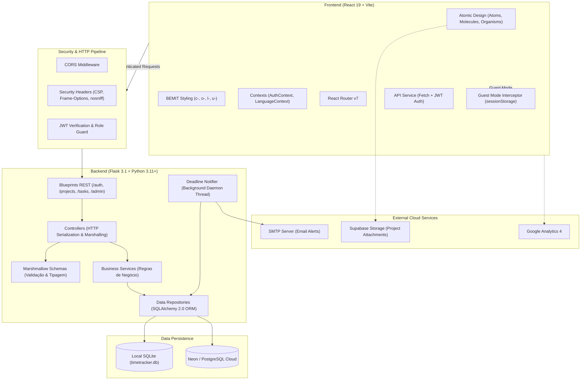

# Time Trackerígena

> Full-stack time tracking, project management, multi-currency cost estimation, and productivity telemetry platform built with layered architecture, Atomic Design + BEMIT CSS methodology, zero-friction guest mode, and inclusive accessibility.

[](https://react.dev)
[](https://flask.palletsprojects.com/)
[](https://www.sqlalchemy.org/)
[](https://www.postgresql.org/)
[](https://jwt.io/)
[](https://csswizardry.com/2015/08/bemit-taking-the-bem-naming-convention-a-step-further/)
[](https://www.w3.org/WAI/standards-guidelines/wcag/)
[](LICENSE)

**Language / Idioma:** **English (Current)** | [Versão em Português](README.md)

---

## Executive Summary

1. [Overview & Value Proposition](#overview--value-proposition)
2. [Why Is This Project Relevant?](#why-is-this-project-relevant)
3. [Engineering & Architectural Decisions](#engineering--architectural-decisions)
4. [Architecture Diagram](#architecture-diagram)
5. [Product Features & Usability](#product-features--usability)
6. [Tech Stack & Rationales](#tech-stack--rationales)
7. [How to Run the Project (Quickstart Guide)](#how-to-run-the-project-quickstart-guide)
8. [Environment Variables](#environment-variables)
9. [REST API Specification](#rest-api-specification)
10. [Repository Structure](#repository-structure)
11. [CSS Methodology (Atomic Design + BEMIT)](#css-methodology-atomic-design--bemit)
12. [Accessibility (WCAG 2.1 AA) & Design System](#accessibility-wcag-21-aa--design-system)
13. [Security & Production Resilience](#security--production-resilience)
14. [License](#license)

---

## Overview & Value Proposition

**Time Trackerígena** is a full-stack web application conceived to bridge the gap left by generic, one-size-fits-all time-tracking utilities. Engineered specifically for freelancers, independent software engineers, and agile squads, it brings together **real-time time tracking**, **granular project management, multi-currency billing, and budget telemetry**.

The platform solves core operational challenges:
- **Accurate Pricing and Invoicing**: Tasks support dedicated hourly rates in customized currencies (BRL, USD, EUR, GBP), budgeted hour targets, and billable status flags.
- **Uninterrupted Continuous Tracking**: A reactive, draggable floating widget ensures that timer sessions persist uninterrupted across tabs, reports, task managers, and calendars.
- **Zero-Friction Guest Mode**: Evaluators and first-time users can explore 100% of the platform's capabilities instantly in the browser through `sessionStorage` mock persistence—no sign-up, credit card, or active backend required for demo walkthroughs.
- **Inclusive & Universal Accessibility**: Compliant with WCAG 2.1 AA standards, featuring dynamic font zoom, dyslexic-friendly typography, calibrated high-contrast mode, text-to-speech hovering via Web Speech API, and seamless light/dark theme switching.
- **Clean & Self-Documenting Code**: Production-grade implementation free of redundant comments, relying on expressive nomenclature, explicit contracts, and strict linting.

---

## Why Is This Project Relevant?

From a software engineering evaluation standpoint, this repository demonstrates five key architectural highlights:

### 1. Strict Layered Architecture
The backend decouples HTTP concerns from business logic completely:
**Routes -> Controllers -> Services -> Repositories -> Models -> Schemas**. This promotes independent unit testing, interchangeable persistence engines, and reusable domain logic.

### 2. Transparent Dual Persistence (Local SQLite / Cloud PostgreSQL)
The codebase dynamically adapts to its runtime:
- In **local development**, it self-provisions an isolated relational SQLite database with enforced relational integrity (`PRAGMA foreign_keys = ON`).
- In **production environments (Render / Neon / Supabase)**, it connects to PostgreSQL using intelligent connection pooling (`pool_pre_ping=True`, `pool_recycle=300`), eliminating dropped connection errors (*SSL SYSCALL EOF* caused by serverless idle timeouts).

### 3. Asynchronous Deadline Telemetry & Notifications
An autonomous background daemon thread runs continuously on the backend, periodically scanning active project and task deadlines and triggering transactional SMTP notification emails with automatic port and security protocol fallbacks (587 TLS / 465 SSL).

### 4. Enterprise-Grade Administration & Auditing
Far beyond a simple toy MVP, the platform includes:
- Role-Based Access Control (RBAC) with dedicated admin-only endpoints.
- Granular immutable audit logs (`AuditLog`) for tracing critical mutations.
- Integrated two-way Helpdesk ticketing system.
- Real-time global maintenance mode that can be toggled without redeploying.

### 5. Atomic Frontend Standardized in BEMIT
Crafted in **React 19** using **Atomic Design principles** combined with the **BEMIT** convention (`c-`, `o-`, `l-`, `u-`, `is-`/`has-`), preventing global scope pollution, achieving native rendering performance, and ensuring ongoing maintainability. Reordering categories, projects, and tasks is smooth and intuitive using modern drag-and-drop primitives (`@dnd-kit/core` and `@dnd-kit/sortable`).

---

## Engineering & Architectural Decisions

| Decision | Alternative Rejected | Rationale |
| :--- | :--- | :--- |
| **Flask + Marshmallow** | FastAPI / Monolithic Django | Flask delivers high modularity without the bloat of Django's conventions, granting complete control over request lifecycles, security middlewares, and strict declarative validation schemas via Marshmallow. |
| **Atomic Design + BEMIT** | CSS Modules / TailwindCSS / CSS-in-JS | Predictable structure, zero runtime overhead, no heavy transpilation dependencies, and complete scope isolation enforced through semantic prefixes (`c-`, `o-`, `l-`, `u-`). |
| **Hybrid Persistence (SQLite/PostgreSQL)** | Mandatory PostgreSQL container | Enables anyone to clone the repository and run the full stack in seconds with zero external container orchestration or database server setup. |
| **Session-Backed Guest Mock DB** | Bare LocalStorage without schemas | Faithfully mimics API response schemas and latency in memory, allowing friction-free testing without polluting production databases. |
| **Native Web Speech API** | Bulky third-party audio packages | Real-time text-to-speech audio feedback for hovered or focused elements with zero network latency or recurring audio API costs. |
| **@dnd-kit over react-beautiful-dnd** | react-beautiful-dnd (deprecated) | `@dnd-kit` is lightweight, actively maintained, fully compatible with React 19, and offers first-class keyboard navigation and screen reader accessibility. |

---

## Architecture Diagram



---

## Product Features & Usability

### 1. Dynamic Stopwatch & Floating Mini-Player
- Start, pause, and record tasks with second-level precision.
- Add context notes and task descriptions to every entry.
- **Draggable Mini-Player**: Track active work sessions across all application pages without losing focus.

### 2. Project and Task Management with Drag-and-Drop
- Group work items into custom Categories.
- Seamless drag-and-drop reordering for projects and tasks (`@dnd-kit`).
- Set customized hourly rates and currency per task.
- Comprehensive deadline change logging (*Deadline History*).
- Project file attachments powered by Supabase Storage.

### 3. Smart Billing & Financial Telemetry
- Automated computation of billable totals based on recorded session durations.
- Advanced history table filtering: timeframes, categories, projects, tasks, and payment status (*Billed* vs *Unbilled*).
- Instant inline editing for previous time entries.

### 4. Productivity Dashboard & Analytics
- Visual data visualization powered by **Recharts**:
  - Time allocation distribution by Category.
  - Per-task time breakdown.
  - Workload density by day of the week.
  - High-level KPIs (Total Hours, Projected Revenue, Pending Tasks).

### 5. Calendar & Deadline Notifications
- Month grid and list views for tracking upcoming delivery milestones.
- Automated deadline scanner dispatching email alerts on milestone dates.

### 6. Comprehensive Administration Suite
- User management: listing, RBAC permission toggling (User <-> Admin), creation, editing, and deletion.
- Audit trail logging with single-record or bulk deletion capabilities.
- Live maintenance mode toggle (displays an advisory screen to regular users).
- Helpdesk ticketing center for user-admin real-time messaging.

---

## Tech Stack & Rationales

### Frontend
- **React 19**: Modern reactive UI engine taking advantage of advanced render cycle optimizations.
- **Vite 8**: Next-generation frontend build tooling with instantaneous server startup and fast HMR.
- **React Router 7**: Declarative client-side routing with protected layout wrappers.
- **@dnd-kit**: Performant, accessible, and lightweight drag-and-drop toolkit.
- **Recharts 3**: Responsive, declarative SVG-based charting library.
- **Lucide React**: Clean and modern SVG icon collection.
- **Vanilla CSS (Design Tokens + BEMIT)**: Pure CSS using custom properties and BEMIT naming, ensuring zero runtime overhead and strict style isolation.

### Backend
- **Python 3.11+ / Flask 3.1**: Lean, scalable microframework for REST APIs.
- **SQLAlchemy 2.0**: Modern ORM utilizing declarative 2.0 mapping syntax.
- **Marshmallow & Marshmallow-SQLAlchemy**: Strict schema validation, sanitization, and serialization.
- **Flask-JWT-Extended**: Stateless token-based authentication with configurable expiry.
- **Flask-Mail**: Transactional email dispatcher for user activation and deadline reminders.
- **Bcrypt**: Adaptive salted cryptographic password hashing.
- **Gunicorn 23**: High-concurrency WSGI HTTP server for production deployments.

### Database & Cloud Services
- **SQLite**: Local file-based relational database for zero-config local development.
- **PostgreSQL (Neon / Render / Supabase)**: High-availability managed cloud relational database.
- **Supabase**: Object cloud storage for project files and attachments.

---

## How to Run the Project (Quickstart Guide)

### Prerequisites
- **Node.js** (v18+ recommended)
- **Python** (v3.10+ recommended)
- Package manager: **npm** or **yarn**

---

### 1. Clone the Repository
```bash
git clone https://github.com/Filipiss/time-trackerigena.git
cd time-trackerigena
```

---

### 2. Configure the Backend (API)

```bash
# 1. Enter the backend directory
cd backend

# 2. Create and activate a virtual environment
# On Windows (PowerShell):
python -m venv venv
.\venv\Scripts\Activate.ps1

# On Linux / macOS:
python3 -m venv venv
source venv/bin/activate

# 3. Install Python dependencies
pip install -r requirements.txt

# 4. Create your local environment file
cp .env.example .env

# 5. (Optional) Seed the database with realistic demo data
python seed.py

# 6. Start the API server
python main.py
```
> The API server will be available at `http://127.0.0.1:8000`. When no `DATABASE_URL` is configured, SQLite automatically initializes at `database/timetracker.db`.

---

### 3. Configure the Frontend

Open a new terminal session and run:

```bash
# 1. Enter the frontend directory
cd frontend

# 2. Install Node dependencies
npm install

# 3. Setup environment variables (if needed)
cp .env.example .env

# 4. Start the development server
npm run dev
```

> Access the frontend in your browser at `http://localhost:5173`.

---

## Environment Variables

### Backend (`backend/.env`)
| Variable | Required? | Example / Default | Description |
| :--- | :---: | :--- | :--- |
| `FLASK_ENV` | No | `development` | Runtime environment (`development` or `production`) |
| `SECRET_KEY` | Yes | `your-long-secret-key` | Application secret key for session signing |
| `JWT_SECRET_KEY` | Yes | `your-jwt-secret-key` | Cryptographic signature key for JWT tokens |
| `DATABASE_URL` | No | *(empty = local SQLite)* | Connection URI for PostgreSQL |
| `MAIL_SERVER` | No | `smtp.gmail.com` | SMTP host for email delivery |
| `MAIL_PORT` | No | `587` | SMTP server port |
| `MAIL_USERNAME` | No | `your-email@gmail.com` | SMTP authentication user |
| `MAIL_PASSWORD` | No | `your-app-password` | SMTP authentication password or app token |

### Frontend (`frontend/.env`)
| Variable | Required? | Example / Default | Description |
| :--- | :---: | :--- | :--- |
| `VITE_API_URL` | No | `http://localhost:8000` | Base URL pointing to the Flask backend |
| `VITE_SUPABASE_URL` | No | `https://xyz.supabase.co` | Supabase project URL for cloud file uploads |
| `VITE_SUPABASE_ANON_KEY` | No | `eyJhbGciOi...` | Supabase anonymous public client key |

---

## REST API Specification

The REST API returns standard JSON payloads enveloped with `{ success: true, data: ... }`.

### Authentication & Profile (`/api/auth`)
| Method | Endpoint | Protected? | Description |
| :--- | :--- | :---: | :--- |
| `POST` | `/api/auth/register` | No | Registers a new account |
| `GET` | `/api/auth/activate` | No | Activates an account via token sent to email |
| `POST` | `/api/auth/login` | No | Authenticates user and issues Bearer JWT |
| `GET` | `/api/auth/me` | Yes | Fetches authenticated user profile |
| `POST` | `/api/auth/forgot-password`| No | Sends password recovery email |
| `POST` | `/api/auth/reset-password` | No | Updates password using recovery token |

### Categories (`/api/categories`)
| Method | Endpoint | Protected? | Description |
| :--- | :--- | :---: | :--- |
| `GET` | `/api/categories/` | Yes | Retrieves all categories |
| `POST` | `/api/categories/` | Yes | Creates a new category |
| `PUT` | `/api/categories/<id>` | Yes | Renames an existing category |
| `DELETE` | `/api/categories/<id>` | Yes | Deletes a category and cascades associations |
| `PATCH` | `/api/categories/reorder` | Yes | Updates display ordering of categories |

### Projects & Attachments (`/api/projects`)
| Method | Endpoint | Protected? | Description |
| :--- | :--- | :---: | :--- |
| `GET` | `/api/projects/` | Yes | Retrieves projects (filters by `?category=`) |
| `POST` | `/api/projects/` | Yes | Creates a project |
| `GET` | `/api/projects/<id>` | Yes | Gets project details |
| `PUT` | `/api/projects/<id>` | Yes | Updates project status, deadline, and notes |
| `DELETE` | `/api/projects/<id>` | Yes | Deletes project and related tasks |
| `PATCH` | `/api/projects/reorder` | Yes | Updates display sequence of projects |
| `GET` | `/api/projects/<id>/attachments` | Yes | Lists project file attachments |
| `POST` | `/api/projects/<id>/attachments` | Yes | Attaches a file reference to a project |
| `PATCH` | `/api/projects/<id>/attachments/<att_id>` | Yes | Updates attachment attributes (color tag) |
| `DELETE` | `/api/projects/attachments/<att_id>` | Yes | Removes a project attachment |

### Tasks (`/api/tasks`)
| Method | Endpoint | Protected? | Description |
| :--- | :--- | :---: | :--- |
| `GET` | `/api/tasks/` | Yes | Lists tasks (`category`, `project_id` filters) |
| `POST` | `/api/tasks/` | Yes | Creates a task with color, rate, and budget |
| `GET` | `/api/tasks/<id>` | Yes | Retrieves single task record |
| `PUT` | `/api/tasks/<id>` | Yes | Updates task and records deadline adjustments |
| `DELETE` | `/api/tasks/<id>` | Yes | Deletes task and related time entries |
| `PATCH` | `/api/tasks/reorder` | Yes | Updates task sorting order |

### Time Entries & Statistics (`/api/time-entries`)
| Method | Endpoint | Protected? | Description |
| :--- | :--- | :---: | :--- |
| `GET` | `/api/time-entries/` | Yes | Retrieves entries (`task_id`, `category`, dates) |
| `POST` | `/api/time-entries/` | Yes | Creates a time entry |
| `PUT` | `/api/time-entries/<id>` | Yes | Updates entry start/end, duration, or notes |
| `DELETE` | `/api/time-entries/<id>` | Yes | Deletes an entry |
| `GET` | `/api/time-entries/stats` | Yes | Returns aggregated metrics by category and weekday |

### Calendar Deadlines (`/api/calendar_events`)
| Method | Endpoint | Protected? | Description |
| :--- | :--- | :---: | :--- |
| `GET` | `/api/calendar_events/` | Yes | Lists all calendar events for the user |
| `POST` | `/api/calendar_events/` | Yes | Creates a deadline event with status and date |
| `PUT` | `/api/calendar_events/<id>`| Yes | Updates calendar event details |
| `DELETE` | `/api/calendar_events/<id>`| Yes | Deletes a calendar event |

### Support & Helpdesk (`/api/support`)
| Method | Endpoint | Protected? | Description |
| :--- | :--- | :---: | :--- |
| `POST` | `/api/support` | Yes | Creates a support ticket |
| `GET` | `/api/support` | Yes | Lists tickets created by current user |
| `GET` | `/api/support/<id>/messages` | Yes | Retrieves ticket message conversation thread |
| `POST` | `/api/support/<id>/messages` | Yes | Sends a response message to a ticket |

### Admin Console (`/api/admin`)
| Method | Endpoint | Protected? | Description |
| :--- | :--- | :---: | :--- |
| `GET` | `/api/admin/users` | Admin | Lists all platform users |
| `POST` | `/api/admin/users` | Admin | Creates a user administratively |
| `PUT` | `/api/admin/users/<id>` | Admin | Modifies any user profile |
| `PUT` | `/api/admin/users/<id>/role` | Admin | Toggles admin privileges |
| `DELETE` | `/api/admin/users/<id>` | Admin | Deletes user from platform |
| `GET` | `/api/admin/metrics` | Admin | Fetches global platform analytics |
| `GET` | `/api/admin/logs` | Admin | Lists system audit trail |
| `DELETE` | `/api/admin/logs/<id>` | Admin | Removes single audit log |
| `POST` | `/api/admin/logs/delete-bulk` | Admin | Bulk deletes selected audit logs |
| `DELETE` | `/api/admin/logs/clear` | Admin | Clears all audit history |
| `GET` | `/api/admin/support` | Admin | Lists all user tickets |
| `PUT` | `/api/admin/support/<id>/status`| Admin | Updates ticket status |
| `DELETE` | `/api/admin/support/<id>` | Admin | Deletes a support ticket |

---

## Repository Structure

```text
time-trackerigena/
├── backend/
│   ├── controllers/          # HTTP Controllers (serialization and marshalling)
│   ├── docs/                 # Supplementary API technical documentation
│   ├── models/               # Relational declarative models (SQLAlchemy 2.0)
│   ├── repositories/         # Database persistence and query logic
│   ├── routes/               # Blueprint definitions and HTTP routing
│   ├── schemas/              # Serialization schemas and validation (Marshmallow)
│   ├── services/             # Core business rules and orchestration logic
│   ├── utils/                # Database engine, audit logger, mailer, notifier
│   ├── .env.example          # Environment variable template for backend
│   ├── main.py               # Flask application factory and entry point
│   ├── requirements.txt      # Python dependencies
│   └── seed.py               # Database seeder with realistic test records
│
├── frontend/
│   ├── src/
│   │   ├── assets/           # Static images and branding assets
│   │   ├── components/
│   │   │   ├── atoms/        # Badge, Button, ColorDot, Input, Select, Spinner
│   │   │   ├── molecules/    # StatCard, TaskCard, NavItem, UserWidget, TabButton
│   │   │   ├── organisms/    # TimerWidget, CalendarBoard, BillingTable, Modals
│   │   │   ├── pages/        # TimerPage, TasksPage, DashboardPage, AdminPages
│   │   │   └── templates/    # MainLayout, AdminLayout
│   │   ├── contexts/         # AuthContext (JWT) and LanguageContext (i18n)
│   │   ├── utils/            # GuestMock, currency helpers, date & password tools
│   │   ├── api.js            # Unified HTTP client with Guest mode interceptor
│   │   ├── App.jsx           # Main route tree and context provider setup
│   │   ├── index.css         # Global design tokens and base styles
│   │   └── main.jsx          # React DOM root entrypoint
│   ├── package.json          # Node dependencies and project metadata
│   └── vite.config.js        # Vite bundler configuration
│
├── database/                 # Directory holding local SQLite database file
├── render.yaml               # Infrastructure-as-code blueprint (Render Cloud)
├── README.md                 # Primary documentation in Portuguese
└── README_EN.md              # Complete English documentation
```

---

## CSS Methodology (Atomic Design + BEMIT)

To achieve predictability, zero class name collisions, and maximum runtime performance without CSS-in-JS overhead, the frontend utilizes **BEMIT** (*BEM + Inverted Triangle CSS*):

| Prefix | Layer | Purpose | Example |
| :--- | :--- | :--- | :--- |
| `c-` | **Component** | Self-contained, styled modular components | `.c-button`, `.c-timer__bar`, `.c-task-card` |
| `o-` | **Object** | Structural patterns without cosmetic styling | `.o-card`, `.o-color-dot` |
| `l-` | **Layout** | Page layout, grids, and sidebar structures | `.l-sidebar`, `.l-main-layout` |
| `u-` | **Utility** | High-specificity single-purpose utilities | `.u-fade-in`, `.u-truncate`, `.u-spin` |
| `is-` / `has-` | **State** | Dynamic and transient element state flags | `.is-active`, `.is-running`, `.is-disabled` |

**Key Advantages:**
- Complete elimination of ambiguous or colliding selectors.
- Highly readable JSX directly matching CSS selectors without `styles[className]` indirection.
- Native browser performance with zero runtime CSS computation.

---

## Accessibility (WCAG 2.1 AA) & Design System

Accessibility is treated as a **first-class non-functional requirement**:

- **Floating Accessibility Dock**: Instant access to inclusive utilities from any page.
- **Text-to-Speech Engine (Web Speech API)**: Audible speech narration when focusing or hovering over elements.
- **Dyslexia-Friendly Typography**: Dynamic font switcher designed to reduce character flipping and reading fatigue.
- **Dynamic Font Scaling**: Relative zoom controller preventing layout breakage or horizontal overflow.
- **Calibrated High Contrast**: Dedicated contrast mode strictly conforming to WCAG 2.1 AA contrast ratios (4.5:1 minimum).
- **Theme Switching (Light / Dark)**: Smooth color transitions with persistent user preference storage.

---

## Security & Production Resilience

- **OWASP HTTP Security Headers**: Automatic injection of protective headers:
  - `X-Content-Type-Options: nosniff`
  - `X-Frame-Options: SAMEORIGIN`
  - `X-XSS-Protection: 1; mode=block`
  - `Referrer-Policy: strict-origin-when-cross-origin`
  - `Content-Security-Policy: default-src 'none'; frame-ancestors 'none'`
- **Database Connection Pool Resilience**: SQLAlchemy configured with `pool_pre_ping=True` and `pool_recycle=300`, preventing dropped connection failures on serverless databases (Neon, Supabase).
- **Hardened Password Hashing**: Salted Bcrypt hashing with adaptive work factor.
- **Immutable Audit Logging**: Key business mutations are permanently recorded in the `AuditLog` table.

---

## License

This project is licensed under the terms of the **MIT License**. See [LICENSE](LICENSE) for details.
